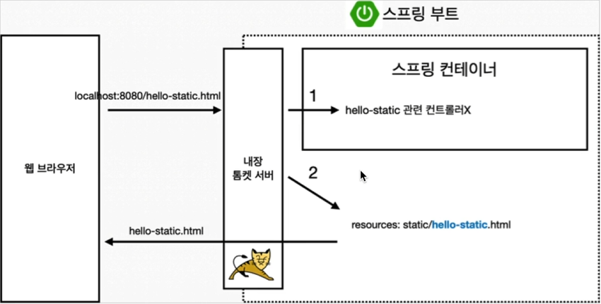
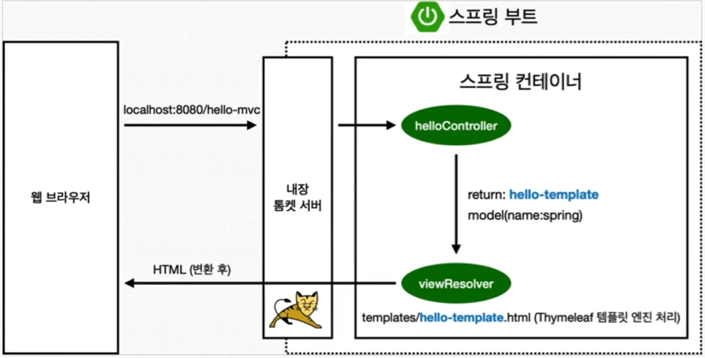
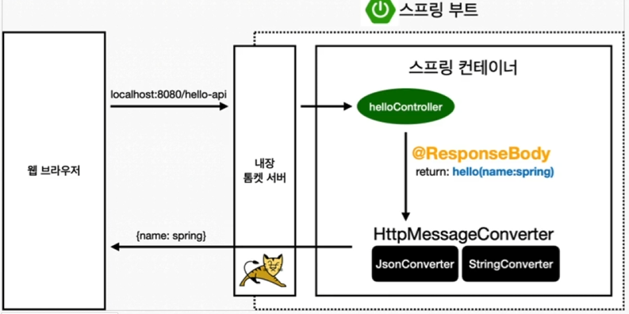

스프링 입문 - 코드로 배우는 스프링 부트, 웹 MVC, DB 접근 기술

## 빌드
1. `./gradlew build` or `./gradlew clean build`
   </br> clean: 이전 빌드 파일 삭제
2. `cd ./build/libs`
3. `java -jar hello-spring-0.0.1-SNAPSHOT.jar` </br>
   => 배포할 때, 서버에 jar 파일을 올리고 실행하면 된다.

## 스프링 웹 개발 기초
### 정적 컨텐츠
- `resources/static/hello-static.html` 파일 생성
- `http://localhost:8080/hello-static.html`로 접속 => 화면 확인 가능
- 스프링 부트는 기본적으로 정적 컨텐츠를 제공 해 줌 

- tomcat 서버가 브라우저에서 요청을 받으면 우선 Controller가 있는지 확인하고 없으면 static 폴더에서 찾는다.

### MVC와 템플릿 엔진
MVC: Model, View, Controller
- 예전엔 JSP를 가지고 Controller를 따로 두지 않고 View에서 모든 과정을 처리했지만, 현재는 Controller를 따로 두고 View에서는 화면을 그리는 역할만 한다. 
- 비지니스 로직이나 내부적인 것들은 거의 Model, Controller에서 처리한다.
</br>
</br>
**Controller**</br>
```java
@Controller
public class HelloController {
    @GetMapping("hello-mvc")
    public String helloMvc(@RequestParam("name") String name, Model model) {
        model.addAttribute("name", name);
        return "hello-template";
    }
}
```
**View**</br>
```html
<!DOCTYPE html>
<html xmlns:th="http://www.thymeleaf.org">
<body>
<p th:text="'hello ' + ${name}">hello! empty</p>
</body>
</html>
```
예시 코드 `java/HelloSpringApplication.java` => hello-mvc</br>



### API
**@ResponseBody 문자 반환** </br>
```java
@Controller
public class HelloController {
    @GetMapping("hello-string")
    @ResponseBody
    public String helloString(@RequestParam("name") String name) {
        return "hello " + name;
    }
}
```

**@ResponseBody 사용 원리**</br>

* `@ResponseBody`를 사용
   * HTTP의 BODY에 문자 내용을 직접 반환
   * `viewResolver` 대신에 `HttpMessageConverter`가 동작
   * 기본 문자처리: `StringHttpMessageConverter`
   * 기본 객체처리: `MappingJackson2HttpMessageConverter`
   * byte 처리 등등 기타 여러 `HttpMessageConverter`가 기본으로 등록되어 있음

   > 참고: 클라이언트의 HTTP Accept 해더와 서버의 컨트롤러 반환 타입 정보 둘을 조합해서 `HttpMessageConverter`가 선택된다.


