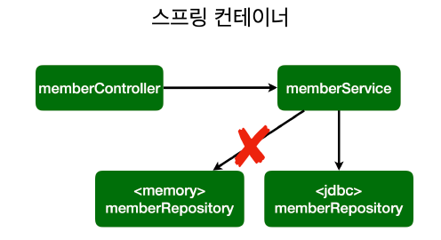

스프링 입문 - 코드로 배우는 스프링 부트, 웹 MVC, DB 접근 기술

## 빌드
1. `./gradlew build` or `./gradlew clean build`
   </br> clean: 이전 빌드 파일 삭제
2. `cd ./build/libs`
3. `java -jar hello-spring-0.0.1-SNAPSHOT.jar` </br>
   => 배포할 때, 서버에 jar 파일을 올리고 실행하면 된다.

## 스프링 웹 개발 기초
### 정적 컨텐츠
- `resources/static/hello-static.html` 파일 생성
- `http://localhost:8080/hello-static.html`로 접속 => 화면 확인 가능
- 스프링 부트는 기본적으로 정적 컨텐츠를 제공 해 줌 

- tomcat 서버가 브라우저에서 요청을 받으면 우선 Controller가 있는지 확인하고 없으면 static 폴더에서 찾는다.

### MVC와 템플릿 엔진
MVC: Model, View, Controller
- 예전엔 JSP를 가지고 Controller를 따로 두지 않고 View에서 모든 과정을 처리했지만, 현재는 Controller를 따로 두고 View에서는 화면을 그리는 역할만 한다. 
- 비지니스 로직이나 내부적인 것들은 거의 Model, Controller에서 처리한다.
</br>
</br>
**Controller**</br>
```java
@Controller
public class HelloController {
    @GetMapping("hello-mvc")
    public String helloMvc(@RequestParam("name") String name, Model model) {
        model.addAttribute("name", name);
        return "hello-template";
    }
}
```
**View**</br>
```html
<!DOCTYPE html>
<html xmlns:th="http://www.thymeleaf.org">
<body>
<p th:text="'hello ' + ${name}">hello! empty</p>
</body>
</html>
```
예시 코드 `java/HelloSpringApplication.java` => hello-mvc</br>


### API
**@ResponseBody 문자 반환** </br>
```java
@Controller
public class HelloController {
    @GetMapping("hello-string")
    @ResponseBody
    public String helloString(@RequestParam("name") String name) {
        return "hello " + name;
    }
}
```

**@ResponseBody 사용 원리**</br>

* `@ResponseBody`를 사용
   * HTTP의 BODY에 문자 내용을 직접 반환
   * `viewResolver` 대신에 `HttpMessageConverter`가 동작
   * 기본 문자처리: `StringHttpMessageConverter`
   * 기본 객체처리: `MappingJackson2HttpMessageConverter`
   * byte 처리 등등 기타 여러 `HttpMessageConverter`가 기본으로 등록되어 있음

   > 참고: 클라이언트의 HTTP Accept 해더와 서버의 컨트롤러 반환 타입 정보 둘을 조합해서 `HttpMessageConverter`가 선택된다.
  
## 회원 관리 예제 - 백엔드 개발
### 비즈니스 요구사항 정리
- 데이터: 회원 ID, 이름
- 기능: 회원 등록, 조회

**앱 어플리케이션 계층 구조**</br>

- 컨트롤러: 웹 MVC의 컨트롤러 
- 서비스: 핵심 비즈니스 로직 구현 (ex. 중복 가입 제한)
- 리포지토리: 데이터베이스에 접근, 도메인 객체를 DB에 저장하고 관리
- 도메인: 비즈니스 도메인 객체
- 컨트롤러 -> 서비스 -> 리포지토리 -> DB

**클래스 의존관계**</br>

- 데이터 저장소가 선정되지 않아, 우선 인터페이스 구현 클래스를 변경할 수 있도록 설계

### 회원 도메인과 리포지토리 만들기
**회원객체**</br>
domain 패키지에 Member 클래스 생성
```java
public class Member {
    private Long id;
    private String name;
}
```
**회원 리포지토리**</br>
repository 패키지에 MemberRepository 인터페이스 생성
```java
public interface MemberRepository {
    Member save(Member member);
    Optional<Member> findById(Long id);
    Optional<Member> findByName(String name);
    List<Member> findAll();
}
```

**회원 리포지토리 메모리 구현**</br>
repository 패키지에 MemoryMemberRepository 클래스 생성
```java
public class MemoryMemberRepository implements MemberRepository {
    private static Map<Long, Member> store = new HashMap<>();
    private static long sequence = 0L;

    @Override
    public Member save(Member member) {
        member.setId(++sequence);
        store.put(member.getId(), member);
        return member;
    }

    @Override
    public Optional<Member> findById(Long id) {
        return Optional.ofNullable(store.get(id));
    }

    @Override
    public Optional<Member> findByName(String name) {
        return store.values().stream()
                .filter(member -> member.getName().equals(name))
                .findAny();
    }

    @Override
    public List<Member> findAll() {
        return new ArrayList<>(store.values());
    }
}
```
### 테스트케이스 작성
개발한 기능을 실행해서 테스트 할 때, main 메소드를 실행하거나 웹 애플리케이션을 실행해서 테스트하는 것은 번거기에
반복실행이 어렵고, 여러 테스트를 한번에 실행하기 어렵다. 따라서 자바에서 **JUnit**이라는 프레임워크로 테스트를 실행해서 편리하게 테스트할 수 있다.
</br>
**테스트 코드 작성**</br>
`test > java > hello.hello_spring > repository > MemoryMemberRepositoryTest.java`
```java
class MemoryMemberRepositoryTest {
    MemoryMemberRepository repository = new MemoryMemberRepository();

    @AfterEach
    public void afterEach() {
        repository.clearStore();
    }

    @Test
    public void save() {
        Member member = new Member();
        member.setName("spring");

        repository.save(member);

        Member result = repository.findById(member.getId()).get();
        Assertions.assertEquals(member, result);
    }

    @Test
    public void findByName() {
        Member member1 = new Member();
        member1.setName("spring1");
        repository.save(member1);

        Member member2 = new Member();
        member2.setName("spring2");
        repository.save(member2);

        Member result = repository.findByName("spring1").get();

        Assertions.assertEquals(member1, result);
    }

    @Test
    public void findAll() {
        Member member1 = new Member();
        member1.setName("spring1");
        repository.save(member1);

        Member member2 = new Member();
        member2.setName("spring2");
        repository.save(member2);

        List<Member> result = repository.findAll();

        Assertions.assertEquals(2, result.size());
    }
}
```

### 회원 서비스 개발
서비스는 레파지토리와 도메인을 활용해서 비즈니스 로직을 처리한다.
</br>
**회원 서비스 기능 구현**</br>
`service > MemberService.java`
```java
public class MemberService {
    private final MemberRepository memberRepository;

    public MemberService(MemberRepository memberRepository) {
        this.memberRepository = memberRepository;
    }

    /**
     * 회원 가입
     */
    public Long join(Member member) {
        // 같은 이름이 있는 중복 회원X
        validateDuplicateMember(member); // 중복 회원 검증
        memberRepository.save(member);
        return member.getId();
    }

    private void validateDuplicateMember(Member member) {
        memberRepository.findByName(member.getName())
                .ifPresent(m -> {
                    throw new IllegalStateException("이미 존재하는 회원입니다.");
                });
    }

    /**
     * 전체 회원 조회
     */
    public List<Member> findMembers() {
        return memberRepository.findAll();
    }

    public Optional<Member> findOne(Long memberId) {
        return memberRepository.findById(memberId);
    }
}
```

### 회원 서비스 테스트
**테스트 코드 작성**</br>
`test > java > hello.hello_spring > service > MemberServiceTest.java`
```java
class MemberServiceTest {
    MemberService memberService;
    MemoryMemberRepository memberRepository;

    @BeforeEach
    public void beforeEach() {
        memberRepository = new MemoryMemberRepository();
        memberService = new MemberService(memberRepository);
    }

    @AfterEach
    public void afterEach() {
        memberRepository.clearStore();
    }

    @Test
    void 회원가입() {
        // given
        Member member = new Member();
        member.setName("hello");

        // when
        Long saveId = memberService.join(member);

        // then
        Member findMember = memberService.findOne(saveId).get();
        Assertions.assertEquals(member.getName(), findMember.getName());
    }

    @Test
    public void 중복_회원_예외() {
        // given
        Member member1 = new Member();
        member1.setName("spring");

        Member member2 = new Member();
        member2.setName("spring");

        // when
        memberService.join(member1);
        IllegalStateException e = assertThrows(IllegalStateException.class, () -> memberService.join(member2));

        // then
        Assertions.assertEquals(e.getMessage(), "이미 존재하는 회원입니다.");
    }
}
```

## 스프링 빈과 의존관계
### 스프링 빈을 등록하고, 의존관계 설정하기
회원 컨트롤러가 회원 서비스와 회원 리포지토리를 사용할 수 있도록 의존관계를 설정한다.
**스프링 빈을 등록하는 2가지 방법**</br>
- 컴포넌트 스캔과 자동 의존관계 설정
- 자바 코드로 직접 스프링 빈 등록하기</br>

**컴포넌트 스캔과 자동 의존관계 설정**</br>
- `@Component` 어노테이션이 있으면 스프링 빈으로 자동 등록된다.
- `@Controller`, `@Service`, `@Repository`는 `@Component`를 포함하고 있으므로 스프링 빈으로 자동 등록된다.
- 메인 애플리케이션(`hello.hello_spring`)이 있는 패키지 하위에 있는 모든 컴포넌트를 스캔한다. (다른 곳에 등록된 경우는 스캔하지 않음)
```java
@Controller
public class MemberController {
    private final MemberService memberService;

    @Autowired
    public MemberController(MemberService memberService) {
        this.memberService = memberService;
    }
}
```


* `memberService`와 `memberRepository`는 스프링 빈으로 등록되어 있어야 한다.
* `@Controller`, `@Service`, `@Repository` 등을 사용하면 스프링 빈으로 자동 등록된다.
> 참고: 스프링은 스프링 컨테이너에 스프링 빈을 등록할 때 싱글톤으로 등록한다. 따라서 같은 스프링 빈이면 모두 같은 인스턴스다. 설정으로 싱글톤이 아니게 설정할 수 있지만, 특별한 경우를 제외하면 대부분 싱글톤을 사용한다.</br> 

**자바 코드로 직접 스프링 빈 등록하기**</br>
- 회원 서비스와 회원 리포지토리를 직접 스프링 빈으로 등록하고, 의존관계를 설정한다.
- `@Service`, `@Repository`, `@Autowired`를 사용하지 않고 직접 설정한다.
```java
// hello.hello_spring.SpringConfig.java
package hello.hello_spring;

import hello.hello_spring.repository.MemberRepository;
import hello.hello_spring.repository.MemoryMemberRepository;
import hello.hello_spring.service.MemberService;
import org.springframework.context.annotation.Bean;
import org.springframework.context.annotation.Configuration;

@Configuration
public class SpringConfig {

    @Bean
    public MemberService memberService() {
        return new MemberService(memberRepository());
    }

    @Bean
    public MemberRepository memberRepository() {
        return new MemoryMemberRepository();
    }
}
```
**예제의 경우 향후 메모리 리포지터리를 다른 리포지터리로 변경할 예정이마르, 컴포넌트 방식 대신 직접 스프링 빈으로 등록하는 방식을 사용한다.**
> 참고: DI(Dependency Injection)에는 필드 주입, setter 주입, 생성자 주입 이렇게 3가지 방식이 있다.</br>
> 의존관계가 실행 중에 동적으로 변하는 경우는 거의 업기 때문에 **생성자 주입**을 권장한다.</br>

> 참고: 실무에서는 주로 정형화된 컨트롤러, 서비스, 레파지토리 같은 코드는 컴포넌트 스캔을 사용한다. 그리고 정형화 되지 않거나, 상황에 따라 구현 클래스를 변경해야 하는 경우에는 설정을 통해 스프링 빈으로 등록한다.

> 참고: `@Autowired`를 통한 DI는 `hello.hello_spring` 패키지 이하에서만 동작한다. 따라서 `SpringConfig` 클래스를 만들어서 직접 스프링 빈을 등록하고, 의존관계를 설정한다.

## H2 데이터베이스 설치
- https://www.h2database.com
- 권한 설정(Mac): `chmod 755 h2.sh`
- 실행: (Mac)`./h2.sh`, (Window)`./h2.bat`
- 데이터베이스 파일 생성 방법
    - `jdbc:h2:~/test` (최초 한번)
    - `~/test.mv.db` 파일 생성 확인
    - 이후부터는 `jdbc:h2:tcp://localhost/~/test` (이미 생성된 파일 사용)

### 테이블 생성하기
- `/sql/ddl.sql` 파일 생성
```sql
drop table if exists member CASCADE;
create table member
(
    id bigint generated by default as identity,
    name varchar(255),
    primary key (id)
);
```
## 순수 Jdbc (참고용)
### 환경 설정
**`build.gradle` 파일에 jdbc, h2 데이터베이스 관련 라이브러리 추가**
```gradle
dependencies {
    implementation 'org.springframework.boot:spring-boot-starter-jdbc'
    runtimeOnly 'com.h2database:h2'
}
```

**`application.properties` 파일에 h2 데이터베이스 설정 추가**
- `src/main/resources/application.properties`
```properties
spring.datasource.url=jdbc:h2:tcp://localhost/~/test
spring.datasource.driver-class-name=org.h2.Driver
spring.datasource.username=sa
```

**`SpringConfig` 클래스에 데이터베이스 설정 추가**
```java
@Configuration
public class SpringConfig {

    private DataSource dataSource;

    @Autowired
    public SpringConfig(DataSource dataSource) {
        this.dataSource = dataSource;
    }

    @Bean
    public MemberService memberService() {
        return new MemberService(memberRepository());
    }

    @Bean
    public MemberRepository memberRepository() {
        return new JdbcMemberRepository(dataSource);
    }
}
```
- DataSource는 데이터베이스 커넥션을 획득할 때 사용하는 객체다. 스프링 부트는 데이터베이스 커넥션 정보를 바탕으로 DataSource를 생성하고 스프링 빈으로 만들어 두기 때문에 DI를 받을 수 있다.

**`JdbcMemberRepository` 클래스 생성**
```java
public class JdbcMemberRepository implements MemberRepository {

  // JDBC를 사용하기 위해 DataSource를 주입받음
  private final DataSource dataSource;

  public JdbcMemberRepository(DataSource dataSource) {
    this.dataSource = dataSource;
  }

  @Override
  public Member save(Member member) {
    String sql = "insert into member(name) values(?)";

    Connection conn = null;
    PreparedStatement pstmt = null;
    ResultSet rs = null;
    try {
      conn = getConnection();
      pstmt = conn.prepareStatement(sql, Statement.RETURN_GENERATED_KEYS);
      pstmt.setString(1, member.getName());
      pstmt.executeUpdate();// DB에 쿼리가 날라감
      rs = pstmt.getGeneratedKeys(); // 자동으로 생성된 키 값을 받아옴

      if (rs.next()) {
        member.setId(rs.getLong(1));
      } else {
        throw new SQLException("id 조회 실패");
      }
      return member;
    } catch (Exception e) {
      throw new IllegalStateException(e);
    } finally {
      close(conn, pstmt, rs);
    }
  }

  @Override
  public Optional<Member> findById(Long id) {
    String sql = "select * from member where id = ?";
    Connection conn = null;
    PreparedStatement pstmt = null;
    ResultSet rs = null;
    try {
      conn = getConnection();
      pstmt = conn.prepareStatement(sql);
      pstmt.setLong(1, id);
      rs = pstmt.executeQuery();
      if(rs.next()) {
        Member member = new Member();
        member.setId(rs.getLong("id"));
        member.setName(rs.getString("name"));
        return Optional.of(member);
      } else {
        return Optional.empty();
      }
    } catch (Exception e) {
      throw new IllegalStateException(e);
    } finally {
      close(conn, pstmt, rs);
    }
  }

  @Override
  public Optional<Member> findByName(String name) {
    String sql = "select * from member where name = ?";
    Connection conn = null;
    PreparedStatement pstmt = null;
    ResultSet rs = null;
    try {
      conn = getConnection();
      pstmt = conn.prepareStatement(sql);
      pstmt.setString(1, name);
      rs = pstmt.executeQuery();
      if(rs.next()) {
        Member member = new Member();
        member.setId(rs.getLong("id"));
        member.setName(rs.getString("name"));
        return Optional.of(member);
      }
      return Optional.empty();
    } catch (Exception e) {
      throw new IllegalStateException(e);
    } finally {
      close(conn, pstmt, rs);
    }
  }

  @Override
  public List<Member> findAll() {
    String sql = "select * from member";
    Connection conn = null;
    PreparedStatement pstmt = null;
    ResultSet rs = null;
    try {
      conn = getConnection();
      pstmt = conn.prepareStatement(sql);
      rs = pstmt.executeQuery();
      List<Member> members = new ArrayList<>();
      while(rs.next()) {
        Member member = new Member();
        member.setId(rs.getLong("id"));
        member.setName(rs.getString("name"));
        members.add(member);
      }
      return members;
    } catch (Exception e) {
      throw new IllegalStateException(e);
    } finally {
      close(conn, pstmt, rs);
    }
  }

  private Connection getConnection() {
    return DataSourceUtils.getConnection(dataSource);
  }

  private void close(Connection conn, PreparedStatement pstmt, ResultSet rs) {
    try {
      if (rs != null) {
        rs.close();
      }
    } catch (SQLException e) {
      e.printStackTrace();
    }
    try {
      if (pstmt != null) {
        pstmt.close();
      }
    } catch (SQLException e) {
      e.printStackTrace();
    }
    try {
      if (conn != null) {
        close(conn);
      }
    } catch (SQLException e) {
      e.printStackTrace();
    }
  }

  private void close(Connection conn) throws SQLException {
    DataSourceUtils.releaseConnection(conn, dataSource);
  }
}
```

**구현 클래스 추가 이미지**


**스프링 설정 이미지**

- 개방-폐쇄 원칙(OCP, Open-Closed Principle): 확장에는 열려있고, 수정에는 닫혀있어야 한다.
- 스프링의 DI(Dependency Injection)을 사용하면 **기존 코드를 전혀 손대지 않고 설정만으로 구현 클래스를 변경할 수 있다.**
- 데이터를 DB에 저장하므로 스프링 서버를 다시 실행해도 데이터가 안전하게 저장된다.

## 스프링 통합 테스트
스프링 컨테이너와 DB까지 연결한 통합 테스트를 진행한다.

```java
// test > java > hello.hello_spring > service > MemberServiceIntegrationTest.java

import java.beans.Transient;

@SpringBootTest
@Transactional
class MemberServiceIntegrationTest {

    @Autowired MemberService memberService;
    @Autowired MemberRepository memberRepository;

    @Test
    void 회원가입() {
        // given
        Member member = new Member();
        member.setName("spring");

        // when
        Long saveId = memberService.join(member);

        // then
        Member findMember = memberService.findOne(saveId).get();
        Assertions.assertEquals(member.getName(), findMember.getName());
    }

    @Test
    public void 중복_회원_예외() {
        // given
        Member member1 = new Member();
        member1.setName("spring");

        Member member2 = new Member();
        member2.setName("spring");

        // when
        memberService.join(member1);
        IllegalStateException e = assertThrows(IllegalStateException.class, () -> memberService.join(member2));

        // then
        Assertions.assertEquals(e.getMessage(), "이미 존재하는 회원입니다.");
    }
}
```
- `@SpringBootTest`: 스프링 컨테이너와 테스트를 함께 실행한다.
- `@Transactional`: 테스트 케이스에 이 어노테이션이 있으면, 테스트 시작 전에 트랜잭션을 시작하고, 테스트 완료 후에 항상 롤백한다. 따라서 다음 테스트에 영향을 주지 않는다.

## 스프링 JdbcTemplate
- 순수 Jdbc와 동일한 환경설정을 하면 된다.
- 스프링 JdbcTemplate과 MyBatis 같은 라이브러리는 JDBC API에서 본 반복 코드를 대부분 제거해준다. 하지만 SQL은 직접 작성해야 한다.

** 스프링 JdbcTemplate 사용하기**</br>
```java
// hello.hello_spring > SpringConfig.java
public class MemberService {
    @Bean
    public MemberRepository memberRepository() {
        return new JdbcTemplateMemberRepository(dataSource);
    }
}
```

**스프링 JdbcTemplate 회원 레포지토리**</br>
```java
// repository > JdbcTemplateMemberRepository.java
@Repository
public class JdbcTemplateMemberRepository implements MemberRepository {

    private final JdbcTemplate jdbcTemplate;

    @Autowired
    public JdbcTemplateMemberRepository(DataSource dataSource) {
        jdbcTemplate = new JdbcTemplate(dataSource);
    }

    @Override
    public Member save(Member member) {
        SimpleJdbcInsert jdbcInsert = new SimpleJdbcInsert(jdbcTemplate);
        jdbcInsert.withTableName("member").usingGeneratedKeyColumns("id");
  
        Map<String, Object> parameters = new HashMap<>();
        parameters.put("name", member.getName());
  
        Number key = jdbcInsert.executeAndReturnKey(new MapSqlParameterSource(parameters));
        member.setId(key.longValue());
        return member;
    }

    @Override
    public Optional<Member> findById(Long id) {
        List<Member> result = jdbcTemplate.query("select * from member where id = ?", memberRowMapper(), id);
        return result.stream().findAny();
    }

    @Override
    public Optional<Member> findByName(String name) {
        List<Member> result = jdbcTemplate.query("select * from member where name = ?", memberRowMapper(), name);
        return result.stream().findAny();
    }

    @Override
    public List<Member> findAll() {
        return jdbcTemplate.query("select * from member", memberRowMapper());
    }

    private RowMapper<Member> memberRowMapper() {
        return (rs, rowNum) -> {
            Member member = new Member();
            member.setId(rs.getLong("id"));
            member.setName(rs.getString("name"));
            return member;
        };
    }
}
```

## JPA
- JPA(Java Persistence API): 자바 진영의 ORM 기술 표준
- JPA는 기존의 반복 코드는 물론, 기본적인 SQL도 직접 작성하지 않아도 된다.
- JPA를 사용하면 SQL과 데이터 중심의 설계에서 객체 중심의 설계로 패러다임 전환을 할 수 있다.
- JPA를 사용하면 개발 생산성을 크게 높일 수 있다.

**build.gradle에 JPA 관련 라이브러리 추가**
```gradle
dependencies {
    implementation 'org.springframework.boot:spring-boot-starter-data-jpa'
    runtimeOnly 'com.h2database:h2'
}
```
`spring-boot-starter-data-jpa` 내부에 jdbc 관련 라이브러리가 포함되어 있어서 jdbc 관련 라이브러리를 추가할 필요가 없다.

**스프링부트에 JPA 설정 추가**
```properties
spring.jpa.show-sql=true
spring.jpa.hibernate.ddl-auto=none // update, create 등
```

**JPA Entity 매핑**
```java
// domain > Member.java
@Entity
public class Member {
    @Id @GeneratedValue(strategy = GenerationType.IDENTITY)
    private Long id;
    private String name;
}
```

**JPA Repository**
```java
// repository > JpaMemberRepository.java
@Repository
public class JpaMemberRepository implements MemberRepository {

    private final EntityManager em;

    @Autowired
    public JpaMemberRepository(EntityManager em) {
        this.em = em;
    }

    @Override
    public Member save(Member member) {
        em.persist(member);
        return member;
    }

    @Override
    public Optional<Member> findById(Long id) {
        Member member = em.find(Member.class, id);
        return Optional.ofNullable(member);
    }

    @Override
    public Optional<Member> findByName(String name) {
        List<Member> result = em.createQuery("select m from Member m where m.name = :name", Member.class)
                .setParameter("name", name)
                .getResultList();
        return result.stream().findAny();
    }

    @Override
    public List<Member> findAll() {
        return em.createQuery("select m from Member m", Member.class)
                .getResultList();
    }
}
```

**서비스 계층에 트랜잭션 추가**
```java
// service > MemberService.java
@Transactional
public class MemberService {
    private final MemberRepository memberRepository;
}
```
- `orm.springframework.transaction.annotation.Transactional`을 사용하자
- 스프링은 해당 클래스의 메서드를 실행할 때 트랜젝션을 시작하고, 메서드가 정상 종료되면 트랜젝션을 커밋한다. 만약 런타임 예외가 발생하면 롤백한다.
- **JPA를 통한 모든 데이터 변경은 트랜잭션 안에서 실행해야한다**

**JPA를 사용하도록 스프링 설정 변경**
```java
// SpringConfig.java
@Configuration
public class SpringConfig {
    
    private final EntityManager em;

    @Autowired
    public SpringConfig(EntityManager em) {
        this.em = em;
    }

    @Bean
    public MemberRepository memberRepository() {
        return new JpaMemberRepository(em);
    }
}
```

## 스프링 데이터 JPA
- 스프링 부트와 JPA만 사용해도 개발 생산성이 정말 많이 증가하지만, 추가로 스프링 데이터 JPA를 사용하면, 기존의 한계를 넘어 리포지토리에 구현 클래스 없이 인터페이스 만으로 개발을 완료할 수 있다.
- 반복 개발해온 기본 CRUD 기능도 스프링 데이터 JPA가 모두 제공한다.
> 주의: 스프링 데이터 JPA는 JPA를 편리하게 사용하도록 도와주는 기술로, JPA를 먼저 학습한 후 스프링 데이터 JPA를 학습해야 한다.

**스프링 데이터 JPA 회원 레포지토리**
```java
// repository > SpringDataJpaMemberRepository.java
public interface SpringDataJpaMemberRepository extends JpaRepository<Member, Long>, MemberRepository {
  Optional<Member> findByName(String name);
}
```

**스프링 데이터 JPA를 사용하도록 스프링 설정 변경**
```java
@Configuration
public class SpringConfig {

    private final MemberRepository memberRepository;

    @Autowired // 스프링 컨테이너에서 레파지토리를 찾음(스프링 데이터 JPA가 자동으로 레파지토리를 만들어줌)
    public SpringConfig(MemberRepository memberRepository) {
        this.memberRepository = memberRepository;
    }

    @Bean
    public MemberService memberService() {
        return new MemberService(memberRepository);
    }
}
```
- 스프링 데이터 JPA가 `SpringDataJpaMemberRepository`를 스프링 빈으로 자동 등록해준다.

**스프링 데이터 JPA 제공 클래스**


**스프링 데이터 JPA 제공 기능**
- 인터페이스를 통한 기본적인 CRUD
- `findByName()`, `findByEmail()` 처럼 메서드 이름만으로 조회 기능 제공
- 페이징 기능 자동 제공
> 참고: 실무에서는 JPA와 스프링 데이터 JPA를 기본으로 하고, 복잡한 동적 쿼리는 Querydsl이라는 라이브러리를 사용하면 된다.
> Querydsl를 사용하면 쿼리도 자바 코드로 안전하게 작성할 수 있고, 동적 쿼리도 편리하게 작성할 수 있다.
> 이 조합으로 해경하기 어려운 경우는 JPA가 제공하는 네이티브 쿼리를 사용하거나, JdbcTemplate을 사용한다.